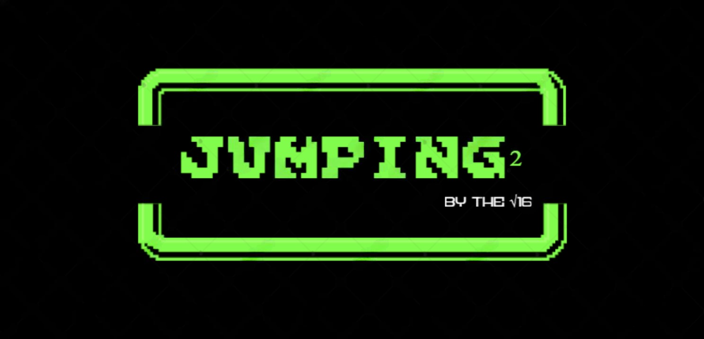
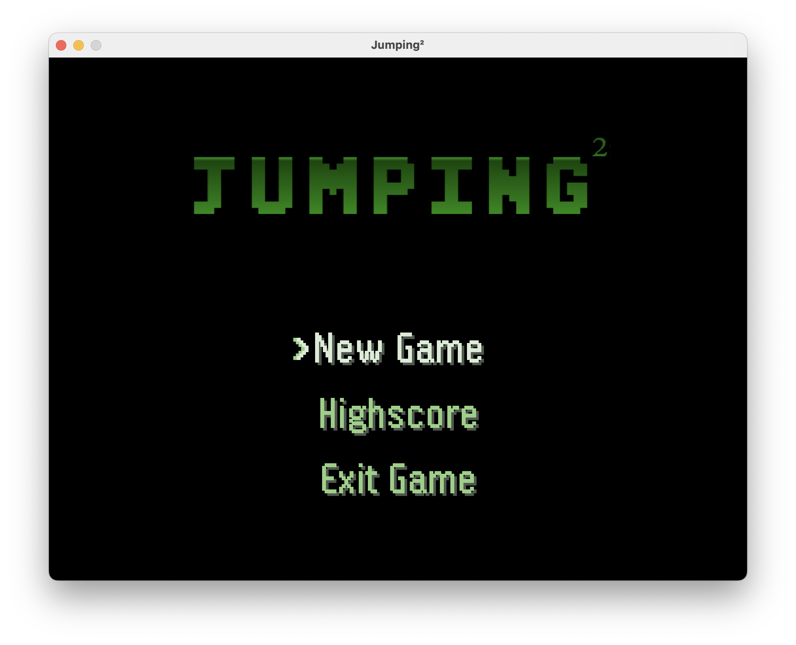
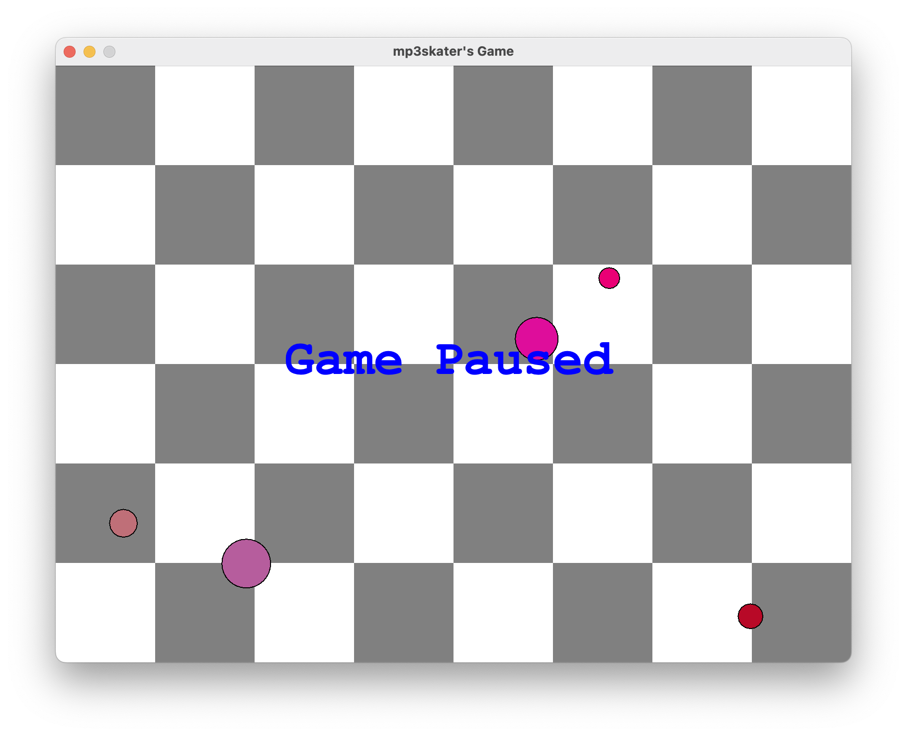

<h1 align="center">
   
</h1>

> A simple desktop 2D platform game built in **JAVA** using the **javax.swing** library. It's a school project in collaboration with three classmates, where everyone works on different aspects of development. This project aims to be a complete video game but should only be considered as a simple side project, made for fun.

## Screenshots

  
  

## Features
This project uses JSON files to store the different levels, look at the detailed explenation (coming soon) in the **src/net/mp3skater/main/Level**-class to create your own and play them.

### Added features
- Oldschool platformer with clean graphics
- Efficient and resource-friendly program
- Sound effects and music
- Start, death and pause menu
- Highscore system that stores the highscores inside of a text file
- Options to regulate and turn off/on the sound effects/music

### In future
- Detailed explenation and way of how to create your own levels
- Highscore page in-game
- Youtube showcase
- Maybe level-edit-modus...

Statement to planning for school

As reported in our initial documentation (not public), we planned to finish the project by May 25. We intended to add experimental features based on popular opinion and ultimately commit them once thoroughly tested. This approach ensures that we can always revert to previous versions if necessary. In the end, this workflow and the tools we used (Git/GitHub, Miro, IntelliJ, JSON files, Java Swing, sounds, etc.) worked surprisingly well, not confronting us with any major problems.

## Youtube showcase (in future)

## Running the game
To run this project you must have **JAVA** installed (preferably [java 22.0.1](https://jdk.java.net/22/) or more). For now you should be able to run the game on any device supporting **IntellIJ Idea**, by running the set run configuration **launch Game** or also by running the class **src/net/mp3skater/main/Main**. Or you can download the [latest release](https://github.com/mp3skater/GetOP-mod-data/releases)(coming soon) and execute it by doubleclicking it on the desktop or inside of the file explorer.

## Technologies
Huge thanks to [RyiSnow](https://www.youtube.com/@RyiSnow) for his amazing tutorials that helped this project massively!

This project was developed using the following frameworks, tools and resources:

 - [Java Swing](https://www.java-tutorial.org/swing.html)
 - [GSON (google's JSON library)](https://google.github.io/gson/)
 - [IntellIJ idea as IDE and build system](https://www.jetbrains.com/idea/)
 - [Logo creator](https://www.textstudio.com)
 - 

Music and sound effect links:
[Minecraft placing sounds](https://tuna.voicemod.net/sound/8632d8b2-c2af-4269-9937-87d2b84e9df1/) [Other sounds](https://pixabay.com/sound-effects/)

## Controls

* You can move the player around by using the `W`, `A`, `S`, `D` keys
* Clicking on the screen spawns platforms only the player collides with
* But stay allert, you can't place more than 2 at a time, place them wisely
* Finish each level and aim for the highscore
* If you fall down or get hit by an enemy, you must restart from the beginning of the level

## The Jumping² team

- [mp3skater](https://github.com/mp3skater) - Project Manager, lead developer and level builder
- [Herwang](https://github.com/Herwang) - Head of design and level builder
- [23paudav](https://github.com/23paudav) - UI developer and level builder
- [Pomipommes](https://github.com/Pomipommes) - Enemy developer and level builder

## License

This project is open source and licensed under the [MIT License](/LICENSE).

<h4>© Copyright √16 2024</h4>

